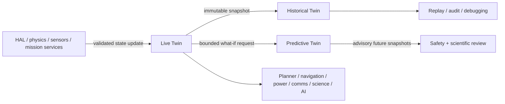
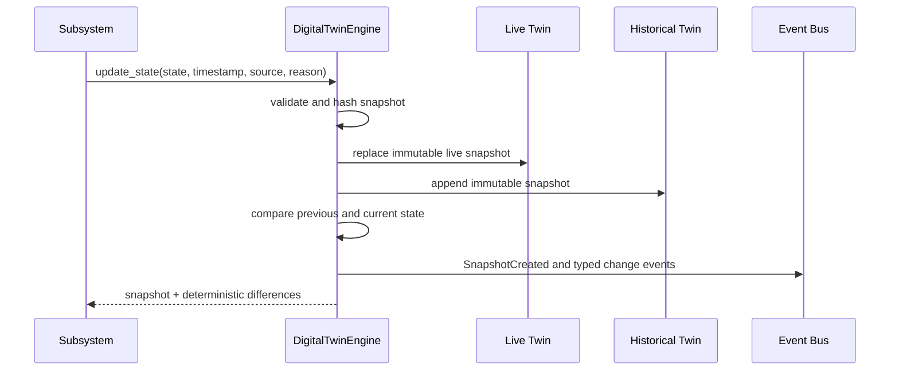
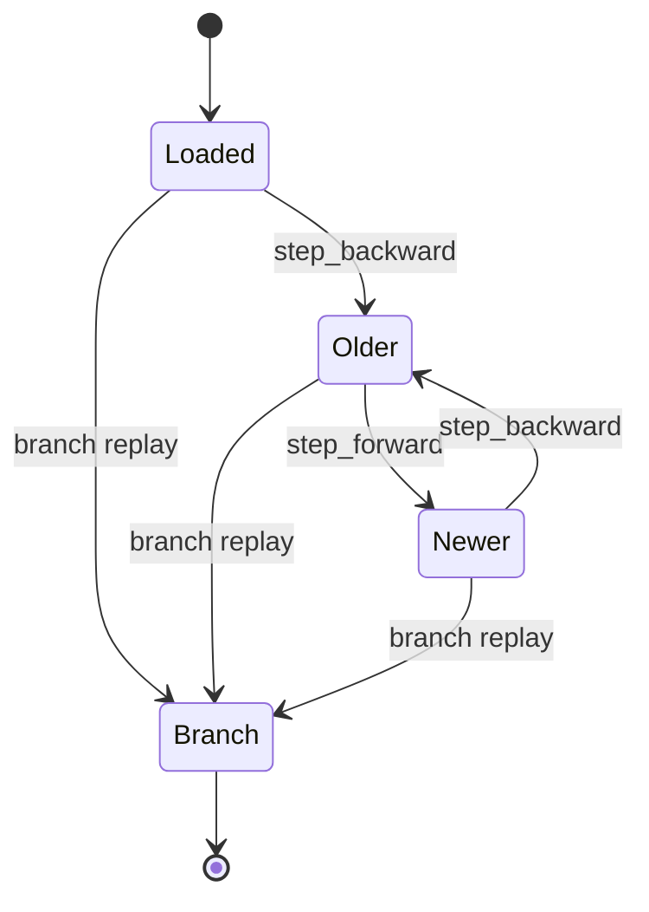

# Predictive Digital Twin Engine

## Purpose

The Predictive Digital Twin Engine is the canonical rover information model. Mission planning, navigation, hardware abstraction, communication, power, physics, science, and AI subsystems must exchange state through this engine rather than maintain competing hardware truth.

The engine is information-only. It exposes no actuator output, motor command, or hardware write API.

## Architecture



### Historical Twin

- append-only immutable snapshots
- deterministic lookup and ordered replay
- forward and backward cursor movement
- branch replay rooted at an explicit parent snapshot
- audit, provenance, debugging, and scientific reproduction

### Live Twin

- one immutable current snapshot
- updates only through `DigitalTwinEngine.update_state`
- deterministic state diffs and typed events
- canonical hardware, sensor, navigation, communication, power, thermal, fault, health, and mission state

### Predictive Twin

- begins from a named live snapshot
- produces immutable future snapshots at a configurable horizon and step
- initially models only battery energy, first-order temperature, mission remaining time, and communication availability
- preserves unsupported or incomplete values and reports them in `PredictionResult.unknowns`

## State update sequence



## Replay state diagram



## Snapshot API

`TwinSnapshot` records:

- deterministic timestamp, mission ID, seed, and environment ID
- hardware and motor state
- sensor values
- navigation position, velocity, orientation, and wheel slip
- communication, power, thermal, fault, warning, health, and mission state
- configuration hash, software version, optimizer version, assumptions, author, and provenance timestamp
- sorted metadata and a SHA-256 snapshot ID

Nested records are frozen dataclasses. Collections use sorted tuples to prevent unstable ordering and accidental mutation.

## Prediction API

```python
request = PredictionRequest(horizon_s=1800, step_s=60)
result = engine.predict(request)
```

`PredictionResult` includes its parent snapshot, deterministic prediction ID, ordered future snapshots, and explicit unknown inputs. Predictions are advisory and are never inserted into canonical history automatically.

## Events

The synchronous typed event bus supports:

- `SnapshotCreated`
- `BatteryChanged`
- `MissionStarted`
- `MissionCompleted`
- `FaultDetected`
- `TemperatureWarning`
- `PredictionFinished`

Subscribers must treat events as notifications. Canonical state remains the corresponding snapshot.

## Assumptions

- timestamps are mission-time seconds supplied by the caller, not wall-clock time
- battery estimation assumes constant load and solar input within each prediction step
- thermal estimation is a configurable first-order approach model
- mission duration assumes a configurable constant progress rate
- communication availability assumes a periodic contact window
- optimizer version is recorded for cross-engine traceability even when a snapshot does not invoke optimization

## Known limitations

- no terrain, rigid-body, wheel-force, radiation, dust, component-aging, or orbital physics prediction
- no persistence database; historical state is currently process-local
- no distributed consensus or concurrent-writer arbitration
- no schema migration framework
- no calibrated uncertainty intervals
- no automatic provenance ingestion from external scientific datasets

## Future extensions

- durable content-addressed snapshot storage
- signed provenance and access control
- uncertainty distributions and ensemble prediction
- calibrated power, thermal, communication, and component degradation models
- simulation checkpoint adapters for PyBullet and Gazebo
- schema versioning and migrations
- cross-subsystem state validation and concurrent update arbitration

## Demonstration

```bash
mars-ai-os twin-demo
```

The demo creates live and historical twins, changes battery/thermal/mission state, emits events, produces deterministic differences, predicts three future states, moves backward and forward through replay, and creates a replay branch.

