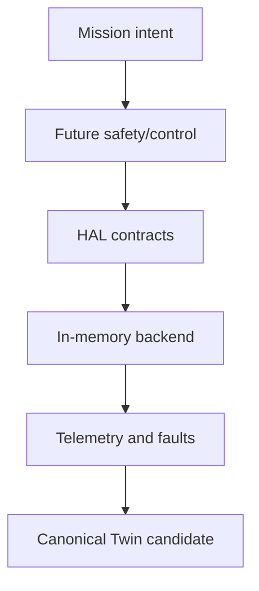

# Safe backend-neutral Rover HAL foundation

## Boundary

High-level mission, AI, navigation, safety, and Digital Twin services use capability contracts; they
never import drivers or simulator APIs. The deterministic in-memory backend implements behavior only,
not BLDC electrical dynamics, CAN/UART, PWM, FOC, PID, navigation, ROS, Gazebo, PyBullet, or hardware control.

## Contracts and units

`DeviceIdentity`, `CommandEnvelope`, `CommandResult`, `TelemetryEnvelope`, `HalFault`, and
`AuditRecord` are immutable. Internal units are explicit: RPM, N*m, C, V, seconds, and SHA-256
configuration/fingerprint values. The eight stable motor IDs are side and position specific, never array-only.

Lifecycle transitions are `CREATED -> INITIALIZED -> READY -> ACTIVE`; safe/stop/fault/shutdown paths
are explicit and shutdown has no exits. Commands have injected-monotonic issue/expiry time, sequence,
source, authorization, target, type, value and unit. Duplicates are idempotent; stale, unknown,
incompatible, un-authorized, over-temperature, low-voltage, faulted, shutdown, and e-stop commands reject.

## Safety

The rover-level e-stop is latched, idempotently safe-stops every registered drive motor, blocks new
commands, retains telemetry, and writes audit records. Explicit authorized clear only moves motors to
stopped; it never restores past motion. The injected watchdog sets zero RPM/torque when refresh expires.
Communication loss must be represented above HAL as loss of command refresh, therefore reaching safe stop.

## Backends, Twin, and Physics

Backend selection is configuration-validated and currently accepts only `in-memory-simulation`.
PyBullet, Gazebo Harmonic/ROS 2 Jazzy, and CAN/UART implementations must satisfy these contracts later.
The Twin adapter returns a fingerprinted candidate and never mutates live or historical state. Physics is
kept separate: a future adapter may use PR #9 prediction outputs for slip-aware encoder, load, battery,
and thermal telemetry without giving Physics authority to command devices.

## Validation and limits

The CLI `mars-ai-os hal-demo` demonstrates initialization, limiting, watchdog, e-stop, explicit clear,
audit and determinism. This is not validated or approved for physical rover deployment. Calibration,
hardware-in-loop tests, verified thermal/motor maps, physical e-stop circuitry, and backend-specific
integration are required before any physical use.
