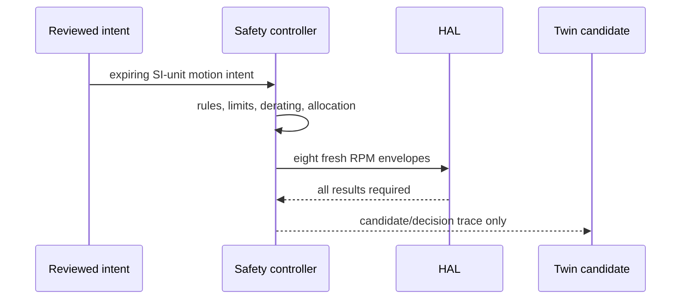

# Reviewed Eight-Wheel Safety Motion Controller

The controller is the only approved software path from reviewed motion intent to HAL drive commands.
Navigation, Physics, optimizer recommendations, and human/mission inputs provide information or intent;
they cannot create motor envelopes. The controller validates an injected-time intent, authorization,
review requirement, controller mode, e-stop, battery, thermal state, physics confidence/risk and HAL
outcomes before it sends eight short-lived commands through public HAL contracts.

Initial allocation is skid-steer approximation: `v_left = v - omega*track/2`,
`v_right = v + omega*track/2`, and `RPM = linear_wheel_speed * 60 / (2*pi*radius)`.
Four canonical left and four canonical right motors receive the respective values. This is not a
validated real-rover model; steering, suspension, slip-aware torque vectoring and degraded mobility
need separate rules and tests.

Modes start SAFE. Motion-capable modes require current authorization, and reviewed/recovery cases need
current explicit human approval. E-stop or critical constraints reject intent. Safe stop sends fresh
zero commands via HAL, is idempotent, and does not clear e-stop or restore old motion. Physics is
advisory: low confidence, severe slip or sinkage rejects; bounded terrain/power/thermal factors derate.
All traces are append-only and fingerprinted. `mars-ai-os control-demo` is a deterministic headless
smoke test. This is simulation software only, not physical rover validation or authority for live Earth driving.
